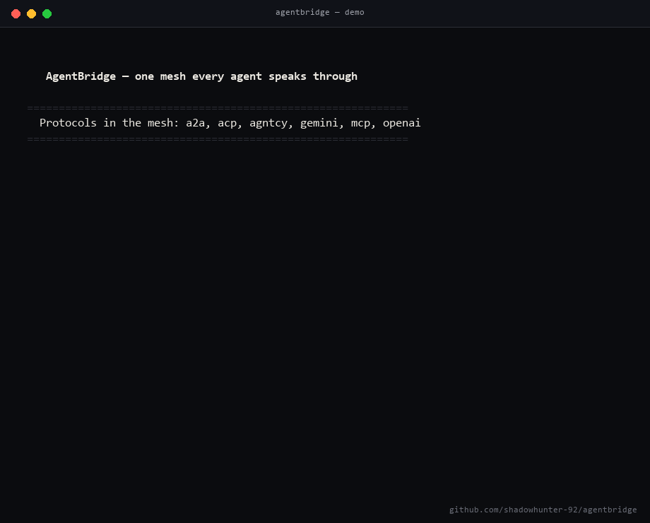
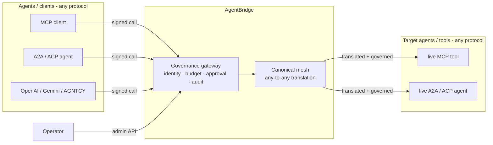

# AgentBridge — the Meta-Bridge

**One neutral mesh every agent speaks through: translate, route, verify, govern.**
Any protocol in, any protocol out — with identity, budgets, and a tamper-evident audit trail
built into the call path.



*The whole product in 12 seconds: an unknown agent blocked, six protocols reaching one live MCP tool through the mesh, budget tracked, tamper-evident audit chain verified. Reproduce with `python examples/demo_story.py`.*

> Status: working prototype. 6 protocols live + conformance-tested against real SDKs, a
> governance plane, an HTTP control plane, and framework integrations. **143 tests passing.**
> Business demand still being validated — this is an early, honest work-in-progress.

> **Name note:** this project (`github.com/shadowhunter-92/agentbridge`) is a Python
> **protocol-translation + governance mesh**. It is unrelated to other products that may share
> the "AgentBridge" name (e.g. connector-gateway SaaS at other domains). This repo is the
> source of truth for *this* AgentBridge.

## Table of contents
[What it does](#what-it-does) · [Quick start](#quick-start) · [Talk to agents yourself](#talk-to-agents-yourself-any-protocol) · [Protocol support matrix](#protocol-support-matrix) · [Architecture](#architecture) · [Security model](#security-model) · [Framework integrations](#framework-integrations-langchain--crewai--autogen--llamaindex) · [Enterprise governance](#enterprise-governance) · [Editions & pricing](#editions--pricing-direction) · [Docs](#docs)

## What it does
- **N-protocol mesh (any-to-any):** MCP (Anthropic), A2A (Google/LF), ACP (IBM/LF), OpenAI
  function-calling, Gemini function-calling, AGNTCY ACP. One canonical model → adding a protocol
  is one adapter, not N² mappings. Every adapter is validated against the protocol's **real
  official SDK**.
- **In-line proxy:** the bridge actually sits *between* live agents on different protocols, not
  just translating (see `examples/`).
- **Governance plane (the moat):** Ed25519 agent identities (DIDs), per-agent spend/rate budgets,
  human-in-the-loop approvals for sensitive capabilities, and a hash-chained tamper-evident audit
  trail — all **enforced in the call path** and **durable** (SQLite; Postgres-swappable).
- **Enterprise governance:** a declarative policy engine (cost caps, business-hours, route/
  capability rules), RBAC for operators, OIDC/JWT operator SSO, and signed audit checkpoints
  (see `docs/ENTERPRISE.md`).
- **Drop-in MCP server:** point Claude Desktop / an IDE / a gateway at it to reach other protocols.
- **Framework integrations:** one helper lets LangChain / CrewAI / AutoGen / LlamaIndex agents
  reach a tool/agent on *any* protocol — they all emit OpenAI-shaped tool calls (see
  `docs/INTEGRATIONS.md`).

## Quick start

```bash
python -m venv .venv && .venv/Scripts/pip install -r requirements.txt   # (Windows; use bin/ on *nix)
```

**Governance is optional.** If you just want one agent/protocol to talk to another, use the
mesh directly — no keys, no budgets, no setup:

```python
from src.protocols import default_registry as reg
from src.protocols.canonical import CanonicalCall

call = reg.get("openai").from_canonical_call(CanonicalCall("add", {"a": 2, "b": 3}))
reg.translate_call(call, "openai", "mcp")     # -> a real MCP tools/call. That's it.
```

```bash
.venv/Scripts/python examples/quickstart.py   # translate + bridge to a LIVE tool, zero governance
```

Add identity, budgets, and a tamper-evident audit trail **only when you want them**:

```bash
# Run the meta-bridge control plane (mesh + governance)
uvicorn src.api.control_plane:app          # docs at http://localhost:8000/docs
#   set AGENTBRIDGE_ADMIN_KEY for operator endpoints; AGENTBRIDGE_DB=/path.db (or a postgres:// URL)

# Or run it as a drop-in MCP server (stdio)
python -m src.serve.mcp_gateway

# Live demos (real agents on both ends)
.venv/Scripts/python examples/live_nprotocol_proxy.py   # OpenAI/ACP -> live MCP, MCP -> live ACP
.venv/Scripts/python examples/live_governed_proxy.py    # identity + budget + audit in action

# Tests
.venv/Scripts/python -m pytest tests/ -q                # 143 passing (+4 Postgres tests skip w/o a DB)
```

## Talk to agents yourself (any protocol)

Yes — you can use AgentBridge to reach an agent/tool that speaks a *different* protocol than
you do. That's the whole point. Give it a call in any protocol's shape; it translates and (if
you want) governs, then delivers to the live target and hands the result back:

```python
import asyncio
from src.integrations import bridge_tool_call
from src.proxy import transport

# You "speak" OpenAI tool-calls; the tool lives behind MCP. Reach it anyway:
async def main():
    result = await bridge_tool_call(
        "add", {"a": 2, "b": 3}, to="mcp",
        invoke=lambda w: transport.call_mcp_tool(
            "python", ["examples/mcp_server_agent.py"], w["params"]["name"], w["params"]["arguments"]),
    )
    print(result)        # -> OpenAI-shaped tool result: "5"

asyncio.run(main())
```

Swap `to="mcp"` for `a2a`, `acp`, `gemini`, or `agntcy` to reach an agent on that protocol.
For agent discovery (A2A AgentCards) and live handshakes, see `examples/live_*_handshake.py`.

## Protocol support matrix

| Protocol | Owner | Adapter | Conformance vs real SDK | Any-to-any | Live agent |
|----------|-------|:-------:|:-----------------------:|:----------:|:----------:|
| **MCP** | Anthropic | ✅ | ✅ `mcp` 1.27 (`CallToolRequestParams`) | ✅ | ✅ FastMCP server (stdio) |
| **A2A** | Google / LF | ✅ | ✅ `a2a-sdk` 0.3 (`Task`, `Message`) | ✅ | ✅ uvicorn agent + AgentCard |
| **ACP** | IBM / BeeAI / LF | ✅ | ✅ `acp-sdk` 1.0 (`Run`, `Message`) | ✅ | ✅ REST `/runs` agent |
| **OpenAI function-calling** | OpenAI | ✅ | ✅ `openai` 2.x (`ChatCompletionMessageToolCall`) | ✅ | ✅ routed to live MCP/ACP |
| **Gemini function-calling** | Google | ✅ | ✅ `google-genai` (`FunctionCall`) | ✅ | ✅ routed to live MCP |
| **AGNTCY ACP** | Cisco | ✅ | ✅ `agntcy-acp` (`RunCreateStateless`) | ✅ | ✅ routed to live MCP |
| **ANP** | — | ⛔ deferred → governance plane | — | — | — |

**6 call protocols, 6×6 = 36 any-to-any pairs, all green.** Adding a 7th is one adapter file +
one registry line + one conformance test. Full detail: `docs/PROTOCOL_SUPPORT.md`. ANP is an
identity/discovery layer, not a call protocol — it informs the governance plane, not an adapter
(see `docs/PROTOCOL_SUPPORT.md`).

## Architecture



Every call enters the **governance gateway** (verify identity → reserve budget → check
approval), is translated through the **canonical mesh** (any protocol → any protocol), is
delivered to the target agent, then committed and written to a tamper-evident audit log.

- `src/protocols/` — canonical hub + per-protocol adapters (the mesh)
- `src/governance/` — identity, audit, budgets, approvals, policy, gateway, persistence (the moat)
- `src/proxy/` — real transport clients + in-line proxy
- `src/api/control_plane.py` — the shipped HTTP API (mesh + governed routing, authenticated)
- `src/serve/mcp_gateway.py` — drop-in MCP server packaging

**Deployment topology:** run it as a drop-in **MCP server** (per-developer), as a central
**control-plane API** (team), or inline as a **proxy** between agents. See `docs/DEPLOYMENT.md`.
Performance overhead is measured in `docs/BENCHMARKS.md`.

## Security model
- **Operator endpoints** require an admin key (`X-Admin-Key`) or — with OIDC configured —
  an IdP bearer token; every endpoint is **RBAC-enforced** (admin/operator/viewer).
- **Agent endpoints** require Ed25519 **signed requests** (`X-Agent-Id`/`X-Nonce`/`X-Signature`)
  with nonce replay protection. Identities can be revoked.
- **Per-IP rate limiting** on `/control/*` (blunts admin-key brute force; `AGENTBRIDGE_RATE_LIMIT`).
- Audit is hash-chained and tamper-evident; export via `/control/audit/export`.

## Persistence
Chosen from `AGENTBRIDGE_DB`: unset → in-memory; a file path → SQLite (single node);
a `postgres://` URL → Postgres (multi-instance; `pip install "psycopg[binary]"`).

## Framework integrations (LangChain / CrewAI / AutoGen / LlamaIndex)

These frameworks all emit OpenAI-shaped tool calls, so **one helper** lets any of them reach a
tool/agent on *any* protocol through the bridge — zero new dependencies:

```python
from src.integrations import bridge_tool_call
# inside a LangChain/CrewAI/AutoGen tool:
result = await bridge_tool_call("add", {"a": 2, "b": 3}, to="mcp", invoke=your_transport)
```

Per-framework wrapping recipes (LangChain `StructuredTool`, CrewAI `@tool`, AutoGen function,
LlamaIndex `FunctionTool`) are in `docs/INTEGRATIONS.md`.

## Enterprise governance

Real, tested controls enterprises ask for — all live over the control-plane HTTP API:

- **Declarative policy engine** — per-call cost caps, approval-above-cost, capability allow/deny,
  business-hours-only, blocked protocol routes (`POST /control/policy/rules`).
- **RBAC** — `admin` / `operator` / `viewer` roles → permissions, enforced per endpoint.
- **OIDC / JWT operator SSO** — verify an IdP token (Okta/Azure AD/Auth0/Keycloak), role claim
  → RBAC role; replaces the shared admin key.
- **Signed audit checkpoints** — third-party-verifiable proof the audit log wasn't truncated;
  JSONL export feeds SIEMs (Splunk/Datadog/S3).

Full usage + code: `docs/ENTERPRISE.md`. (Honestly *not* shipped as code: managed hosting and
SOC 2 — those are operations and an audit process, not a library feature.)

## Editions & pricing (direction)

Open-core: the mesh + basic governance are free and self-hostable (Apache 2.0). Monetization is
hosted governance/compliance, not the translation (which is commoditizing). Indicative tiers
(hypotheses to validate with customers, not live products):

| Edition | Who | What | Price (hypothesis) |
|---------|-----|------|--------------------|
| **OSS core** | builders | mesh + basic governance + drop-in MCP server, self-host | $0 |
| **Pro / Team** | startups | hosted control plane, dashboard, persistence, support | ~$99–499/mo |
| **Business** | scale-ups | RBAC/SSO, cost analytics, alerts, SLA | ~$1k–5k/mo |
| **Compliance** | regulated (finance/health/HR) | EU-AI-Act audit pack, signed export, DPA | ~$2k–10k+/mo |

Detail + the demand-gated roadmap: `docs/ROADMAP.md`.

## Docs
- `docs/DEPLOYMENT.md` — how to run it, configure it, and the honest production checklist
- `docs/API_REFERENCE.md` — the control-plane HTTP endpoints
- `docs/INTEGRATIONS.md` — wire LangChain / CrewAI / AutoGen / LlamaIndex to any protocol
- `docs/ENTERPRISE.md` — policy engine v2, RBAC, OIDC SSO, signed audit checkpoints
- `docs/ROADMAP.md` — what's done, known limitations, and what's deferred (honest)
- `docs/PROTOCOL_SUPPORT.md` — the protocol support matrix + conformance approach
- `docs/LIVE_AGENT_TESTING.md` — how the bridge is tested against real, running agents
- `docs/PROTOBUF_A2A.md` — notes on A2A's JSON-RPC vs protobuf wire formats
- `docs/BENCHMARKS.md` — measured in-process overhead (reproduce with `tools/benchmark.py`)
- `CONTRIBUTING.md` — setup, ground rules, and the add-a-protocol recipe
- `AI_DISCLOSURE.md` — transparency on AI-assisted development

## License
Apache 2.0
