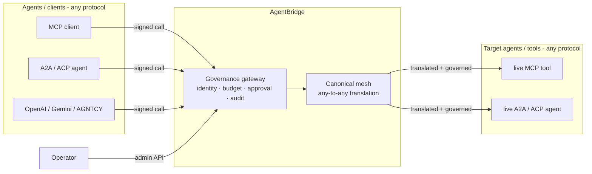

# AgentBridge — the Meta-Bridge

**One neutral mesh every agent speaks through: translate, route, verify, govern.**
Any protocol in, any protocol out — with identity, budgets, and a tamper-evident audit trail
built into the call path.


*The whole product in 12 seconds: an unknown agent blocked, six protocols reaching one live MCP tool through the mesh, budget tracked, tamper-evident audit chain verified. Reproduce with `python examples/demo_story.py`.*

> Status: working prototype. 6 protocols live + conformance-tested against real SDKs, a
> governance plane, and an HTTP control plane. Business demand still being validated — this
> is an early, honest work-in-progress, not a finished product.

## What it does
- **N-protocol mesh (any-to-any):** MCP (Anthropic), A2A (Google/LF), ACP (IBM/LF), OpenAI
  function-calling, Gemini function-calling, AGNTCY ACP. One canonical model → adding a protocol
  is one adapter, not N² mappings. Every adapter is validated against the protocol's **real
  official SDK**.
- **In-line proxy:** the bridge actually sits *between* live agents on different protocols, not
  just translating (see `examples/`).
- **Governance plane (the moat):** Ed25519 agent identities (DIDs), per-agent spend/rate budgets,
  human-in-the-loop approvals for sensitive capabilities, and a hash-chained tamper-evident audit
  trail — all **enforced in the call path** and **durable** (SQLite; Postgres-swappable).
- **Drop-in MCP server:** point Claude Desktop / an IDE / a gateway at it to reach other protocols.
- **Framework integrations:** one helper lets LangChain / CrewAI / AutoGen / LlamaIndex agents
  reach a tool/agent on *any* protocol — they all emit OpenAI-shaped tool calls (see
  `docs/INTEGRATIONS.md`).

## Quick start

```bash
python -m venv .venv && .venv/Scripts/pip install -r requirements.txt   # (Windows; use bin/ on *nix)
```

**Governance is optional.** If you just want one agent/protocol to talk to another, use the
mesh directly — no keys, no budgets, no setup:

```python
from src.protocols import default_registry as reg
from src.protocols.canonical import CanonicalCall

call = reg.get("openai").from_canonical_call(CanonicalCall("add", {"a": 2, "b": 3}))
reg.translate_call(call, "openai", "mcp")     # -> a real MCP tools/call. That's it.
```

```bash
.venv/Scripts/python examples/quickstart.py   # translate + bridge to a LIVE tool, zero governance
```

Add identity, budgets, and a tamper-evident audit trail **only when you want them**:

```bash
# Run the meta-bridge control plane (mesh + governance)
uvicorn src.api.control_plane:app          # docs at http://localhost:8000/docs
#   set AGENTBRIDGE_ADMIN_KEY for operator endpoints; AGENTBRIDGE_DB=/path.db (or a postgres:// URL)

# Or run it as a drop-in MCP server (stdio)
python -m src.serve.mcp_gateway

# Live demos (real agents on both ends)
.venv/Scripts/python examples/live_nprotocol_proxy.py   # OpenAI/ACP -> live MCP, MCP -> live ACP
.venv/Scripts/python examples/live_governed_proxy.py    # identity + budget + audit in action

# Tests
.venv/Scripts/python -m pytest tests/ -q                # 128 passing (+4 Postgres tests skip w/o a DB)
```

## Architecture



Every call enters the **governance gateway** (verify identity → reserve budget → check
approval), is translated through the **canonical mesh** (any protocol → any protocol), is
delivered to the target agent, then committed and written to a tamper-evident audit log.

- `src/protocols/` — canonical hub + per-protocol adapters (the mesh)
- `src/governance/` — identity, audit, budgets, approvals, policy, gateway, persistence (the moat)
- `src/proxy/` — real transport clients + in-line proxy
- `src/api/control_plane.py` — the shipped HTTP API (mesh + governed routing, authenticated)
- `src/serve/mcp_gateway.py` — drop-in MCP server packaging

**Deployment topology:** run it as a drop-in **MCP server** (per-developer), as a central
**control-plane API** (team), or inline as a **proxy** between agents. See `docs/DEPLOYMENT.md`.
Performance overhead is measured in `docs/BENCHMARKS.md`.

## Security model
- **Operator endpoints** require an admin key (`X-Admin-Key`).
- **Agent endpoints** require Ed25519 **signed requests** (`X-Agent-Id`/`X-Nonce`/`X-Signature`)
  with nonce replay protection. Identities can be revoked.
- **Per-IP rate limiting** on `/control/*` (blunts admin-key brute force; `AGENTBRIDGE_RATE_LIMIT`).
- Audit is hash-chained and tamper-evident; export via `/control/audit/export`.

## Persistence
Chosen from `AGENTBRIDGE_DB`: unset → in-memory; a file path → SQLite (single node);
a `postgres://` URL → Postgres (multi-instance; `pip install "psycopg[binary]"`).

## Docs
- `docs/DEPLOYMENT.md` — how to run it, configure it, and the honest production checklist
- `docs/API_REFERENCE.md` — the control-plane HTTP endpoints
- `docs/INTEGRATIONS.md` — wire LangChain / CrewAI / AutoGen / LlamaIndex to any protocol
- `docs/ROADMAP.md` — what's done, known limitations, and what's deferred (honest)
- `docs/PROTOCOL_SUPPORT.md` — the protocol support matrix + conformance approach
- `docs/LIVE_AGENT_TESTING.md` — how the bridge is tested against real, running agents
- `docs/PROTOBUF_A2A.md` — notes on A2A's JSON-RPC vs protobuf wire formats
- `docs/BENCHMARKS.md` — measured in-process overhead (reproduce with `tools/benchmark.py`)
- `CONTRIBUTING.md` — setup, ground rules, and the add-a-protocol recipe
- `AI_DISCLOSURE.md` — transparency on AI-assisted development

## License
Apache 2.0
